Rでスネークゲーム
========================================================

R Advent Calendar 2012 の16日目の記事です。
昨年は [Rで年賀状](http://mokjpn.blogspot.jp/2011/12/r-advent-calendar-rrthe-stanford-3d.html)というのをやりました。今年も何か、干支にちなんだものを...来年は巳年、ヘビですね。ヘビといえばスネーク。スネークといえば、最近は段ボールに隠れたり光学迷彩を使っていろいろなところに潜入する人が有名ですが、私にとっては[スネークゲーム](http://ja.wikipedia.org/wiki/%E3%83%98%E3%83%93%E3%82%B2%E3%83%BC%E3%83%A0)かなぁ、ということで、Rでスネークゲームを作ってみました。

まずは遊んでみてください。


```r
source("http://www.okada.jp.org/~mokada/Rsnake.R")
```


```r
rsnake()
```


ただし、MacOS Xの場合は、Quartzデバイスではキー入力をリアルタイムにとれないので、X11デバイスをアクティブにしておく必要があります。WindowsでもRstudioから実行している場合は同様です。


```r
x11()
```


で、X11デバイスを起動してから rsnake() を呼んでください。

起動すると、8x8のフィールドに四角形がいくつか連なっています□□□■。これがヘビです。ヘビに見えないかもしれませんが、断じてヘビです。グレーの■が頭で、白い□が体です。

ヘビは移動させることができます。h,j,k,lキーでそれぞれ左,下, 上, 右に動きます。vi と同じキーバインドですが、私はEmacs使いなので、これはviではなくNetHackのキーバインドだと思っています。
NetHackに慣れていない方のために、カーソルキーでも操作できるようにはしてあります。

さて、画面上に小さな赤い点が見えると思います。これはヘビのエサです。エサを食べると、ヘビは成長して体の長さが１増えます。そしてスコアも１増えます。こうして、できるだけたくさんエサを食べるのがゲームの目的です。

ヘビは成長していくので、フィールドの中で動くのがだんだん窮屈になってきます。上下左右どの方向にも動けなくなったらゲームオーバーです。

rsnake()関数は、戻り値としてスコアを返します。detailed=TRUE をつけると、総キー入力回数(Inputs)と、ヘビの動いた回数(Movements)もつけてベクタにして戻り値とします。

また、xおよびyをパラメータとして与えると、フィールドを広げることができます。rsnake(x=20, y=20)などとすると20x20の広いフィールドになります。

途中でギブアップするときは、q を押してください。

では、お楽しみください！。。。。。というだけではちょっとつまらないので、「オートモード」をつけてみました。rsnake()はautoパラメータに関数を与えることで、ヘビを自動操縦することができます。autoに与える関数は、たとえば名前をhebi() とすると、

```r
hebi(snake, food, x, y)
```

として呼ばれ、"h", "j", "k", "l" のうちどれから一文字を返すことが期待されます。
snakeパラメータは、ヘビの現在座標、foodはエサの座標、xとyはフィールドの大きさ(rsnake関数呼び出しの際に与えられた値と同じ、デフォルトでは8x8)です。

例として、単に一様分布に従う乱数を用いて進む方向を決めるヘビを作ってみましょう。下記のような関数を定義します。


```r
random <- function(s, food, x, y) {
    return(c("h", "j", "k", "l")[floor(runif(1) * 4) + 1])
}
```


autoパラメータに与えられる関数の値は、キー入力のイベントハンドラ関数に直接渡されますから、実際には進めない方向の値を返しても問題ありません。

では、この関数を使ってヘビを走らせた場合のスコアを10回とってみましょう。


```r
unlist(sapply(1:10, function(x) {
    rsnake(auto = random)
}))
```

 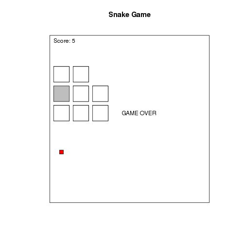 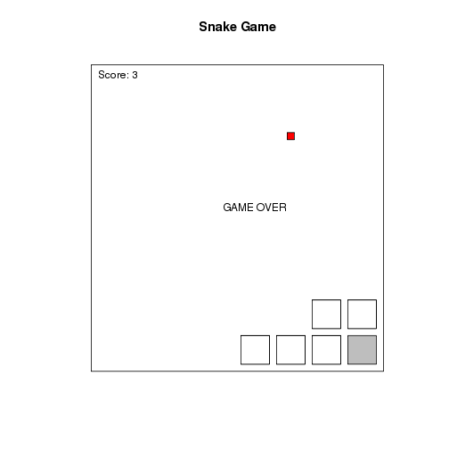 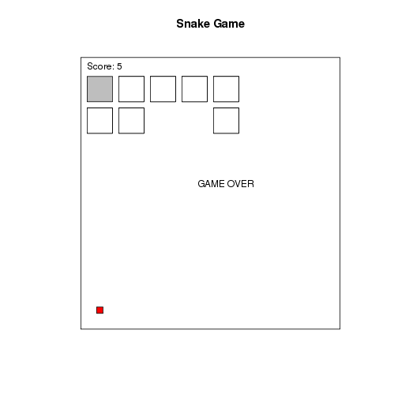 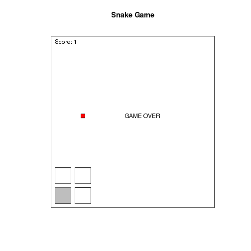 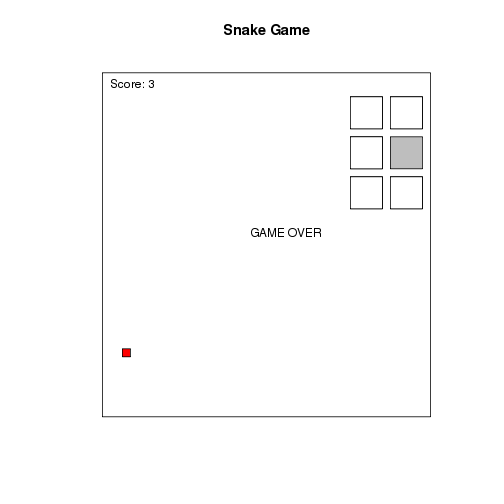 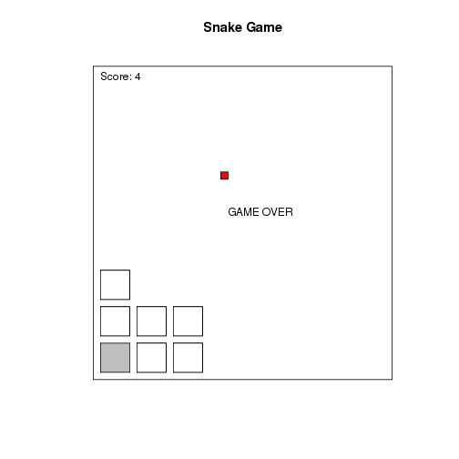 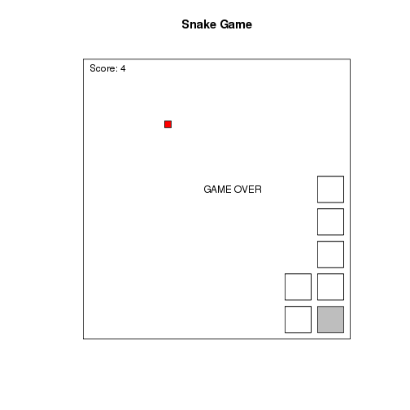 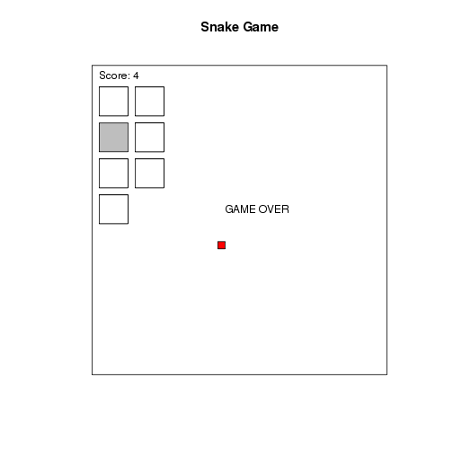 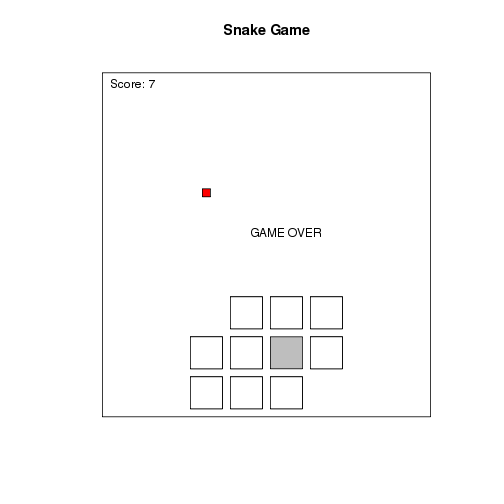 

```
##  [1] 5 5 3 5 1 3 4 4 4 7
```


ヘビが動き回るのが見えて、けっこう面白いのですが、多くの回数繰り返すには動きが見える必要はありません。そこで、plot=FALSE パラメータを追加して、100回繰り返してヒストグラムを書いてみます。


```r
r <- unlist(sapply(1:100, function(x) {
    rsnake(auto = random, plot = FALSE)
}))
hist(r)
```

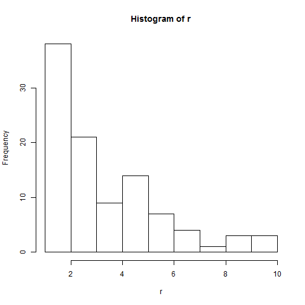 


さすがにこのアルゴリズムではあまり良い点は出ないようですね。では、せっかくエサの位置の情報もあるので、エサに向かって一直線という本能に忠実なヘビを作ってみましょう。


```r
towardsFood2 <- function(snake, food, x, y) {
    bodycheck <- function(newhead) {
        if (newhead[1] < 1 || newhead[1] > x || newhead[2] < 1 || newhead[2] > 
            y) 
            return(FALSE)
        return(sum(sapply(1:length(snake), function(x) {
            identical(snake[[x]], newhead)
        })) == 0)
    }
    rad <- atan2(food[2] - snake[[1]][2], food[1] - snake[[1]][1])/pi + 0.25
    if (rad > 1) 
        rad <- rad - 2
    v <- as.numeric(cut(rad, breaks = c(-1, -0.5, 0, 0.5, 1)))
    nh <- snake[[1]] + list(c(-1, 0), c(0, -1), c(1, 0), c(0, 1))[[v]]
    while (!bodycheck(nh)) {
        v <- v + 1
        if (v > 4) 
            v <- 1
        nh <- snake[[1]] + list(c(-1, 0), c(0, -1), c(1, 0), c(0, 1))[[v]]
    }
    return(c("h", "j", "l", "k")[v])
}
```


単にエサに向かっていくだけだと、その方角に自分の体があったときにそこでスタックしてしまいます。そこで、rsnake()本体でも使っているbodycheck()関数をいれておき、エサの方向が通れないようであったら方向をずらすようにしてあります。


```r
r <- unlist(sapply(1:100, function(x) {
    rsnake(auto = towardsFood2, plot = FALSE)
}))
hist(r)
```

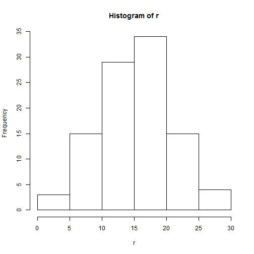 


だいぶ良いスコアになりました。
さらに、移動可能なスペースを稼ぐためになるべく直線的に移動するとか、高スコア化するアイデアも考えられますね。皆さんもぜひより良いヘビ駆動アルゴリズムを考えてみてください！


